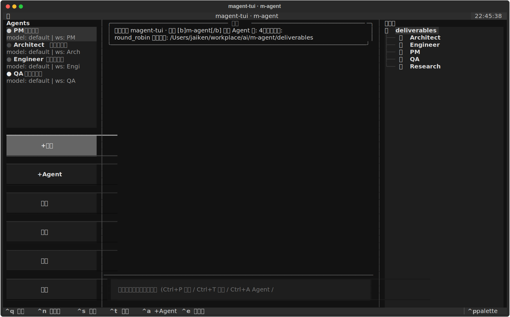
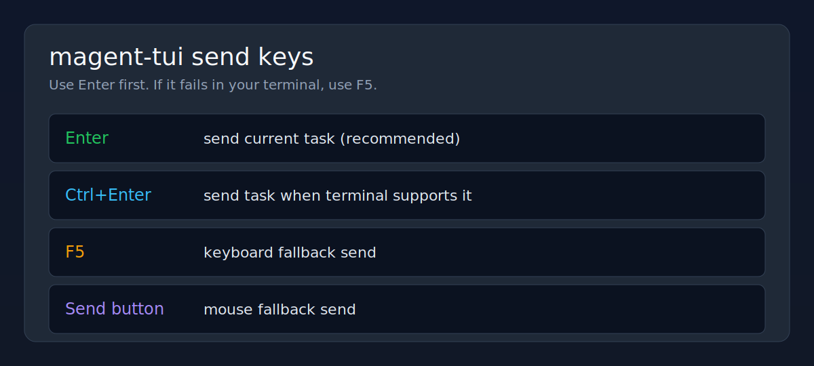
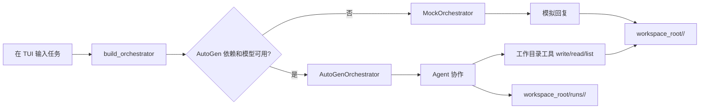

# magent-tui

基于 AutoGen + Textual 的本地多智能体协作 TUI。

它的目标很直接：在终端里快速搭一个“可配置角色 + 可切换模板 + 可落盘交付件”的多 Agent 工作台。你可以用它做产品拆解、代码交付、研究分析、内容生产，也可以把它当成一个多智能体原型底座继续往上改。

当前已经具备这些能力：

- 支持多个 Agent，每个 Agent 都可单独配置 `name`、`role`、`system_prompt`、`model`、`workspace`
- 内置多种常见多 Agent 模板，能一键导入
- 支持从 Claude Code 的 `~/.claude/settings.json` 自动读取模型配置
- 支持手工配置 Anthropic / OpenAI / OpenAI 兼容端点
- 支持 `round_robin` / `selector` / `single` / `pipeline` 四种编排模式
- 真实 AutoGen 模式下，Agent 可调用工作目录工具写文件
- 每次运行会把会话流和过程产物自动落盘
- 运行链路通过 `RunService` 输出统一事件流，便于 UI、日志与回放共用
- 带 TUI 界面，适合边配边跑
- **支持 Claude Agent SDK 集成，可执行真实代码工程**
- **支持 FastAPI 服务器，提供 REST + WebSocket 实时事件流**
- **支持 Tauri 桌面应用，提供跨平台桌面 GUI**
- **支持无头模式，可直接执行任务并输出到终端**

## 目录

- [安装](#安装)
- [界面预览](#界面预览)
- [5 分钟启动](#5-分钟启动)
- [完整演示](#完整演示)
- [CLI 命令](#cli-命令)
- [TUI 怎么用](#tui-怎么用)
- [模型配置](#模型配置)
- [配置文件说明](#配置文件说明)
- [内置模板](#内置模板)
- [运行产物](#运行产物)
- [环境诊断](#环境诊断)
- [常见问题](#常见问题)

## 安装

推荐使用独立虚拟环境。这个项目依赖 `textual`、`autogen-agentchat`、`autogen-ext`，如果直接装进全局环境，容易和你机器上其他 Python 工具的版本冲突。

```bash
python3 -m venv .venv
source .venv/bin/activate
python3 -m pip install -e .
```

如果你后面需要额外能力，也可以安装可选依赖：

```bash
python3 -m pip install -e ".[litellm,anthropic,claude-agent]"
```

**可选依赖说明：**

- `litellm` - LiteLLM 客户端，支持更多模型提供商
- `anthropic` - Anthropic SDK（已内置，可选安装最新版）
- `claude-agent` - Claude Agent SDK，用于代码工程任务（`claude_agent` 工具）

安装完成后确认 CLI 可用：

```bash
magent-tui --help
```

## 界面预览

下面这张图是当前 TUI 的示意截图，方便你先建立直觉：



界面采用 Tab 布局（`Chat` / `Agents` / `Deliverables` / `Config`）：

- `Chat`：系统消息、Agent 回复、任务输入
- `Agents`：模板导入、Agent 新建/编辑/删除
- `Deliverables`：工作目录树 + 文件预览
- `Config`：当前项目配置概览 + 编辑入口

任务发送键位速查：



如果你更关心结构，可以把它理解成下面这个布局：

```text
┌────────────────────────────────────────────────────────────────────────────┐
│ Tabs: [Chat] [Agents] [Deliverables] [Config]                             │
├────────────────────────────────────────────────────────────────────────────┤
│ Chat: 状态条 + 消息流 + 任务输入                                            │
│ Agents: 模板导入 + Agent 管理                                               │
│ Deliverables: workspace_root + runs/<timestamp> + 文件预览                 │
│ Config: 模型、工作流、配置来源状态                                          │
└────────────────────────────────────────────────────────────────────────────┘
```

## 5 分钟启动

### 方式 1：最快启动

直接用默认模板启动：

```bash
magent-tui run
```

不传 `--config` 时，会自动使用内置 `dev_team_oob` 模板启动。

### 方式 2：先生成配置，再启动

1. 列出所有模板

```bash
magent-tui templates
```

2. 生成一份配置文件

```bash
magent-tui init --template dev_team_oob -o configs/my.yaml
```

3. 检查环境是否就绪

```bash
magent-tui doctor --config configs/my.yaml
```

4. 启动 TUI

```bash
magent-tui run --config configs/my.yaml
```

### 方式 3：直接用仓库自带配置

仓库已经带了一份可直接启动的默认配置：

```bash
magent-tui doctor --config configs/default.yaml
magent-tui run --config configs/default.yaml
```

如果你想直接体验“研发团队协作”场景，建议优先使用开箱即用模板配置：

```bash
magent-tui doctor --config configs/dev_team_oob.yaml
magent-tui run --config configs/dev_team_oob.yaml
```

## 完整演示

如果你想从 0 到 1 跑通一次，直接照下面做就行。

### 第 1 步：创建虚拟环境并安装

```bash
python3 -m venv .venv
source .venv/bin/activate
python3 -m pip install -e .
```

### 第 2 步：检查环境

```bash
magent-tui doctor --config configs/default.yaml
```

如果输出里这些项是 `OK`，就说明基础条件已经齐了：

- `textual`
- `autogen_agentchat`
- `autogen_core`
- `autogen_ext`
- `config`
- `claude_settings` 或至少某个 `model:*`

### 第 3 步：启动 TUI

```bash
magent-tui run --config configs/default.yaml
```

启动后建议这样操作：

1. 看左侧 Agent 列表是否已经有 `PM / Architect / Engineer / QA`
2. 按 `Ctrl+P` 检查默认模型和工作目录
3. 如果要换模板，按 `Ctrl+T`
4. 在底部输入框粘贴一条任务并回车

### 第 4 步：运行一条真实任务

可以先用这条：

```text
请围绕“一个带 TUI 的多智能体协作软件”做一次最小产品与实现拆解。

要求：
1. PM 输出目标用户、核心问题、MVP 范围和成功指标。
2. Architect 输出系统模块划分和关键技术决策。
3. Engineer 输出目录结构和最小实现方案。
4. QA 输出测试计划和验收标准。
5. 所有角色把内容写入自己的工作目录。
```

### 第 5 步：检查产物

跑完以后，去右侧文件树或命令行里看这些目录：

```bash
ls -la deliverables
find deliverables -maxdepth 2 -type f | sort
```

通常你会看到：

```text
deliverables/
  PM/
    activity.md
  Architect/
    activity.md
  Engineer/
    activity.md
  QA/
    activity.md
  runs/
    <timestamp>/
      task.md
      summary.md
      transcript.jsonl
      system.md
```

### 第 6 步：验证 Agent 真实写文件能力

如果你想专门确认 tool calling 是通的，可以再发一条很短的任务：

```text
请调用 write_text_file，把文本“hello from agent”写入 smoke.md，然后回复 done。
```

跑完后检查当前 Agent 的工作目录里是否出现 `smoke.md`。

### 第 7 步：保存你的配置

如果你在 TUI 里改过 Agent、模型或 workflow，按：

```text
Ctrl+S
```

当前配置会保存到：

- 你启动时传入的 YAML
- 如果没有传 `--config`，则默认保存到 `configs/current.yaml`

## CLI 命令

### `magent-tui run`

启动 TUI 或无头执行任务。

```bash
# 启动 TUI
magent-tui run
magent-tui run --config configs/default.yaml

# 无头模式：直接执行任务，输出到终端
magent-tui run --task "帮我写一个用户注册系统的PRD"
magent-tui run --task "设计微服务架构" --template dev_team_oob
```

行为说明：

- 不传 `--config` 时，自动用内置 `dev_team_oob` 模板启动
- 传了 `--config` 时，优先读取 YAML
- 如果配置中的模型没有显式 API 信息，运行时会尝试回退到 Claude settings 或环境变量
- `--task` 模式下不启动 TUI，直接执行任务并输出结果

### `magent-tui serve`

启动 FastAPI 服务器，提供 REST API 和 WebSocket 实时事件流。

```bash
magent-tui serve
magent-tui serve --host 0.0.0.0 --port 8765
magent-tui serve --config configs/default.yaml
```

API 端点：

- `GET /api/config` - 获取当前配置
- `PUT /api/config` - 更新配置
- `GET /api/templates` - 列出可用模板
- `POST /api/templates/{name}/apply` - 应用模板
- `GET /api/agents` - 获取 Agent 列表
- `POST /api/agents` - 添加 Agent
- `DELETE /api/agents/{index}` - 删除 Agent
- `GET /api/workspace/tree` - 获取工作目录树
- `GET /api/workspace/file` - 读取文件
- `GET /api/tasks` - 获取任务列表
- `GET /api/runs` - 获取运行记录
- `GET /api/runs/{run_id}/events` - 获取运行事件流
- `WebSocket /ws` - WebSocket 连接，接收实时事件

### `magent-tui init`

生成一份 YAML 配置文件。

```bash
magent-tui init --template research_squad -o configs/research.yaml
```

### `magent-tui templates`

列出所有内置模板。

```bash
magent-tui templates
```

### `magent-tui doctor`

检查环境、依赖、Claude settings、配置文件和模型可用性。

```bash
magent-tui doctor
magent-tui doctor --config configs/default.yaml
```

## 多 Agent 协同能力

本项目实现了完整的多 Agent 协同工作流，支持：

### 1. 多种编排模式

- **`round_robin`** - 固定轮转，按顺序让每个 Agent 发言
- **`selector`** - LLM 选择下一位发言者，更智能的协作
- **`single`** - 单 Agent 模式，快速验证单个角色
- **`pipeline`** - 阶段式协作，前序 Agent 产物传递给后序 Agent

### 2. Agent 工作流

每个 Agent 可独立配置：
- **角色与职责** - 通过 `role` 和 `system_prompt` 定义
- **工作目录** - 每个Agent有独立交付件目录
- **模型选择** - 可为每个Agent指定不同模型
- **工具集** - 支持文件读写、Claude Agent SDK 等

### 3. 真实代码工程能力

通过 **Claude Agent SDK** 集成，Agent 可执行：
- 文件读写（`write_text_file` / `read_text_file`）
- 代码编辑（`Edit` 工具）
- 命令执行（`Bash` 工具）
- 代码搜索（`Grep` / `Glob`）

配置 Agent 使用 `claude_agent` 工具：

```yaml
agents:
  - name: Engineer
    role: 工程师
    tools: ["claude_agent"]  # 启用 Claude Agent SDK
    system_prompt: |
      你是资深工程师。
      当需要编写、修改、调试实际代码时，使用 claude_agent 工具。
```

### 4. 阶段式 Pipeline 模式

Pipeline 模式下，每个阶段自动获得前序阶段的产物摘要：

```yaml
workflow:
  mode: pipeline
  required_artifacts:  # 可选：门禁条件
    - "Engineer/implementation.md"
```

### 5. 实时事件流

所有运行事件通过 `RunService` 输出：
- `run_started` - 运行开始
- `agent_message` - Agent 消息
- `run_completed` / `run_failed` - 运行结束
- 可用于 TUI、日志、回放、Web 前端

### 6. 可扩展架构

- **插件化工具** - 易于添加新工具（Git、数据库、API 等）
- **模板系统** - 内置多种场景模板，支持自定义
- **配置驱动** - YAML 配置，无需修改代码
- **事件驱动** - 统一事件流，便于集成

## TUI 怎么用

TUI 布局大致是三栏：

- 左侧：Agent 列表和管理按钮
- 中间：会话流
- 右侧：工作目录和交付件树

进入 TUI 后，常用操作如下。

### 先做什么

建议第一次进入时按这个顺序：

1. `Ctrl+T` 导入一个模板
2. `Ctrl+P` 检查项目设置、模型和 workflow
3. 左侧选中某个 Agent，必要时点击“编辑”
4. 在底部输入框里输入任务，回车发送
5. 右侧查看 Agent 工作目录和 `runs/` 运行记录

### 常用快捷键

| 键 | 作用 |
|---|---|
| `Enter` | 发送当前任务（推荐） |
| `Ctrl+Enter` | 发送当前任务（终端支持时） |
| `F5` | 发送当前任务（终端兼容兜底） |
| `Ctrl+N` | 新建会话 |
| `Ctrl+S` | 保存当前配置 |
| `Ctrl+P` | 编辑项目设置 / 模型 / 编排 |
| `Ctrl+T` | 导入模板 |
| `Ctrl+A` | 新建 Agent |
| `Ctrl+E` | 刷新并查看交付件目录 |
| `Ctrl+Q` | 退出 |

### 左侧 Agent 面板

左侧支持这些操作：

- `+模板`：导入内置模板，覆盖当前 Agent 列表
- `+Agent`：新建一个 Agent
- `项目`：编辑项目级配置
- `编辑`：编辑当前选中的 Agent
- `删除`：删除当前选中的 Agent
- `清空`：清空全部 Agent

每个 Agent 会显示：

- 名称和角色
- 绑定的模型 key
- 它自己的工作目录

### 项目设置里能改什么

按 `Ctrl+P` 可编辑：

- `project_name`
- `workspace_root`
- `default_model`
- `workflow.mode`
- `workflow.max_turns`
- `workflow.termination_keywords`
- `workflow.selector_prompt`
- 整块 `models` YAML

项目设置里还带了几个模型快捷按钮：

- `Claude 默认`
- `OpenAI 默认`
- `兼容端点模板`

适合先快速生成一份模型配置，再细改。

### 一次任务从输入到落盘的流程



## 模型配置

这个项目支持三种主要来源。

### 1. Claude Code settings

默认会尝试读取：

- `~/.claude/settings.json`
- `~/.config/claude/settings.json`

当前读取逻辑会识别这些字段：

- `env.ANTHROPIC_API_KEY`
- `env.ANTHROPIC_AUTH_TOKEN`
- `env.ANTHROPIC_BASE_URL`
- `env.ANTHROPIC_MODEL`
- 顶层 `model`

这意味着如果你本机已经能正常使用 Claude Code，很多情况下 `magent-tui` 可以直接复用它的模型配置。

### 2. 环境变量

也支持从环境变量读取：

```bash
export ANTHROPIC_API_KEY=...
export ANTHROPIC_MODEL=claude-sonnet-4-5

# 或
export ANTHROPIC_AUTH_TOKEN=...
export ANTHROPIC_BASE_URL=https://your-endpoint.example.com

# 或
export OPENAI_API_KEY=...
export OPENAI_BASE_URL=https://api.openai.com/v1
export OPENAI_MODEL=gpt-4o-mini
```

### 3. YAML 显式配置

你也可以在配置文件里明确写 `models`：

```yaml
default_model: default
models:
  default:
    provider: anthropic
    model: claude-sonnet-4-5
    api_key: YOUR_KEY
    base_url: https://api.anthropic.com
```

或 OpenAI 兼容端点：

```yaml
default_model: default
models:
  default:
    provider: openai_compatible
    model: your-model-name
    api_key: YOUR_KEY
    base_url: https://your-endpoint.example.com/v1
```

### 配置优先级

运行时的优先级可以理解为：

1. `--config` 指定 YAML
2. Claude settings
3. 环境变量
4. 最后才是代码里的占位默认值

注意：

- 如果 YAML 里写了模型名，但没有可用 `api_key` / `base_url`，运行时可能回退到 Claude settings
- `doctor` 会把这种“配置本身没写，但运行时能回退”的情况显示出来

## 配置文件说明

默认配置文件见 [configs/default.yaml](configs/default.yaml)。

最小结构如下：

```yaml
project_name: m-agent
workspace_root: deliverables
default_model: default

models:
  default:
    provider: anthropic
    model: claude-sonnet-4-5

agents:
  - name: PM
    role: 产品经理
    workspace: PM
    system_prompt: |
      你是资深产品经理。

workflow:
  mode: round_robin
  max_turns: 12
  termination_keywords:
    - TERMINATE
    - 任务完成
```

### 顶层字段

- `project_name`：项目名，显示在 TUI 标题栏
- `workspace_root`：所有交付件的根目录
- `default_model`：默认模型 key，Agent 未显式指定模型时使用它
- `models`：模型配置字典
- `agents`：Agent 列表
- `workflow`：多 Agent 编排配置

### `AgentConfig`

每个 Agent 支持：

- `name`
- `role`
- `system_prompt`
- `model`
- `workspace`
- `description`

说明：

- `workspace` 不写时，默认用 `name`
- `model` 不写时，默认用 `default_model`

### `WorkflowConfig`

支持四个模式：

- `round_robin`：按顺序轮流发言
- `selector`：让模型决定下一位发言者
- `single`：只运行第一个 Agent
- `pipeline`：按 Agent 顺序分阶段执行，可配 `required_artifacts` 做门禁

`selector` 模式下，可额外配置 `selector_prompt`。

## 内置模板

当前内置这些模板：

- `product_sprint`：产品冲刺 5 人小队
- `dev_team_oob`：开箱即用研发团队（PM → TechLead → Backend → Frontend → QA → DevOps → TechWriter）
- `content_factory`：内容生产流水线
- `dev_delivery`：需求 -> 实现 -> 测试 -> 文档
- `research_squad`：研究主管 + 搜集 + 分析 + 批判
- `code_review`：代码阅读 + 安全 + 性能 + 综合评审
- `debate`：正方 / 反方 / 裁判

查看模板列表：

```bash
magent-tui templates
```

生成模板配置：

```bash
magent-tui init --template dev_delivery -o configs/dev.yaml
```

## 使用示例

下面这些任务都可以直接复制到 TUI 输入框里运行。

### 示例 1：产品需求拆解

适合模板：`product_sprint`

```text
请围绕“面向独立开发者的 AI Agent 控制台”做一次产品冲刺协作。

要求：
1. PM 输出产品目标、用户画像、核心功能、MVP 边界和成功指标。
2. Research 给出 3 个竞品的对比分析。
3. Architect 输出系统模块划分、核心数据流和技术建议。
4. Engineer 给出目录结构、关键接口和最小实现方案。
5. QA 输出测试计划和验收标准。

所有角色都把自己的产物写入各自工作目录。
```

预期你会在这些目录下看到内容：

- `deliverables/PM/`
- `deliverables/Research/`
- `deliverables/Architect/`
- `deliverables/Engineer/`
- `deliverables/QA/`

### 示例 2：代码交付方案

适合模板：`dev_delivery`

```text
请为一个“支持多角色、多模型、多工作空间配置的 TUI 多智能体系统”生成一版最小可交付方案。

要求：
1. Requirements 先输出功能列表和验收标准。
2. Implementation 给出目录结构、关键类、配置文件结构和最小代码框架。
3. Testing 写出测试用例和验证步骤。
4. Docs 给出 README 大纲和启动说明。

如果需要写文件，请直接写入各自工作目录。
```

这个模板适合把一个模糊需求先收敛成“可开发、可验证、可交付”的第一版。

### 示例 3：深度研究任务

适合模板：`research_squad`

```text
请研究“2026 年面向开发者的多 Agent 产品形态”。

要求：
1. Director 先拆成 4 个子问题。
2. Searcher 为每个子问题收集信息点和来源。
3. Analyst 汇总共同趋势、差异点和关键判断。
4. Critic 专门找可能的反例、风险和不确定性。
5. 最终输出一份结构化研究结论。
```

### 示例 4：代码评审

适合模板：`code_review`

```text
请对当前项目做一次多角色代码评审。

要求：
1. Reader 总结模块结构和关键调用链。
2. Security 检查密钥、权限、路径、输入处理和外部调用风险。
3. Performance 检查无效 IO、重复初始化、阻塞点和潜在瓶颈。
4. Reviewer 汇总 Must / Should / Nice 三档问题清单。

输出写入各自工作目录。
```

### 示例 5：先验证工具调用

如果你只是想确认真实 Agent 能往工作目录写文件，可以在单 Agent 或 `dev_delivery` 模板下先试一条非常短的任务：

```text
请调用 write_text_file，把文本”hello from agent”写入 smoke.md，然后回复 done。
```

跑完后去对应 Agent 的工作目录查看 `smoke.md` 是否生成。

### 示例 6：使用 Claude Agent 执行代码工程

在 `Engineer` Agent 中启用 `claude_agent` 工具，执行真实代码开发：

```yaml
agents:
  - name: Engineer
    role: 工程师
    tools: [“claude_agent”]
    system_prompt: |
      你是资深工程师。
      当需要编写、修改、调试实际代码时，使用 claude_agent 工具。
      传入详细实现指令，Claude Agent 将在项目目录中执行代码工程。
```

任务示例：

```text
请使用 claude_agent 工具，实现一个用户注册模块：
1. 创建数据模型
2. 实现 API 路由
3. 添加验证逻辑
4. 编写单元测试

要求：所有代码写入 deliverables/Engineer/ 目录。
```

Claude Agent 会自动执行文件读写、代码编辑、测试运行等操作。

## 运行产物

所有产物默认写到 `workspace_root` 下。

### Agent 工作目录

每个 Agent 都有自己的目录，例如：

```text
deliverables/
  PM/
  Architect/
  Engineer/
  QA/
```

真实 AutoGen 模式下，Agent 可以使用这些工具在自己的目录里读写文件：

- `write_text_file`
- `append_text_file`
- `read_text_file`
- `list_workspace_files`

### 运行记录目录

每次任务运行还会生成一份按时间戳命名的运行记录：

```text
deliverables/
  runs/
    20260422-230501/
      run.json
      task.md
      summary.md
      transcript.jsonl
      events.jsonl
      system.md
```

其中：

- `task.md`：本次任务
- `summary.md`：运行摘要
- `transcript.jsonl`：消息流
- `events.jsonl`：结构化运行事件
- `system.md`：系统消息

同时，各个 Agent 的工作目录下还会持续追加 `activity.md`。

## 环境诊断

如果项目启动不了，第一步不要猜，先运行：

```bash
magent-tui doctor --config configs/default.yaml
```

`doctor` 会检查：

- `textual` / `pydantic` / `autogen_*` 是否安装
- 配置文件是否可解析
- Claude settings 是否存在且可读取
- 环境变量中的模型配置
- `models` / `default_model` 是否一致
- 当前配置是否可通过运行时回退拿到模型连接信息

## 常见问题

### 1. 能启动 TUI，但运行时还是 mock 模式

通常是这几种原因：

- `autogen_agentchat` / `autogen_core` / `autogen_ext` 没装
- 配置文件里的模型没有可用的 `api_key` / `base_url`
- Claude settings 没有被正确读取

先跑：

```bash
magent-tui doctor --config configs/default.yaml
```

### 2. Claude Agent SDK 没安装怎么办

Claude Agent SDK 是可选依赖：

```bash
pip install claude-agent-sdk
```

安装后，在 Agent 配置中添加 `tools: ["claude_agent"]` 即可使用。

### 3. Claude settings 里明明有模型，为什么还跑不起来

先确认你的 `settings.json` 里是否真的包含这些字段之一：

- `ANTHROPIC_API_KEY`
- `ANTHROPIC_AUTH_TOKEN`
- `ANTHROPIC_BASE_URL`
- `ANTHROPIC_MODEL`

另外，某些自定义模型名不是官方 Anthropic 名称，AutoGen 默认不认识。项目里已经对这类模型做了兜底处理，但前提是 `base_url` 和认证信息本身要可用。

### 3. 为什么建议用虚拟环境

因为 `textual`、`rich`、`autogen-*` 很容易和其他终端工具的依赖版本冲突。最省事的做法就是：

```bash
python3 -m venv .venv
source .venv/bin/activate
python3 -m pip install -e .
```

### 4. 发送任务没反应怎么办

先确认你在 `Chat` 页（`Ctrl+1`），然后按下面顺序排查：

1. 直接按 `Enter` 发送（最稳定）
2. 如果 `Enter` 也不触发，按 `F5`
3. 仍失败就点击“发送”按钮
4. 最后运行 `magent-tui doctor --config configs/dev_team_oob.yaml` 检查环境

补充说明：

- 少数终端会吞掉 `Ctrl+Enter`，优先使用 `Enter` 或 `F5`
- 如果当前任务正在运行，输入框不会再次提交（状态栏会提示“运行中...”）

### 5. 这项目更适合拿来做什么

目前最适合：

- 多 Agent 工作流原型
- 本地 TUI 多智能体调度台
- 带交付件目录的 AutoGen 实验项目
- 继续往上做”角色市场 / 模板市场 / 工具集成 / 文件编辑代理”的基础工程
- **使用 Claude Agent SDK 进行真实代码工程**
- **搭建多智能体协作的 Web 应用或桌面应用**

### 6. 如何开发 Tauri 桌面应用

项目包含完整的 Tauri 桌面应用：

```bash
# 安装依赖
npm install

# 开发模式
npm run tauri dev

# 构建生产版本
npm run tauri build
```

前端使用 React + TypeScript + Tailwind CSS，通过 WebSocket 连接到 FastAPI 服务器。

### 7. 如何开发 Web 前端

项目使用 Vite 构建：

```bash
cd frontend
npm install
npm run dev
```

API 调用通过 `/api/*` 端点，WebSocket 连接 `/ws` 端点。

## 开发建议

如果你准备继续开发这套系统，推荐优先做这几件事：

1. 给 `models` 做真正的列表式 UI，而不是只编辑 YAML
2. 给 Agent 增加更多工具，比如 shell、代码执行、搜索、Git 操作
3. 增加并维持自动化测试，覆盖配置解析、运行产物和 doctor 输出
4. 增加会话持久化和历史回放
5. 增加模板导入导出
6. 完善 Web 前端和 Tauri 桌面应用的 UI/UX
7. 添加更多 Claude Agent 工具场景（数据库、API 集成等）

## 许可证

仓库里目前还没有单独的 LICENSE 文件。如果你准备公开发布，建议尽快补上。

## 运行测试

```bash
python -m unittest discover -s tests -p "test_*.py"
```
